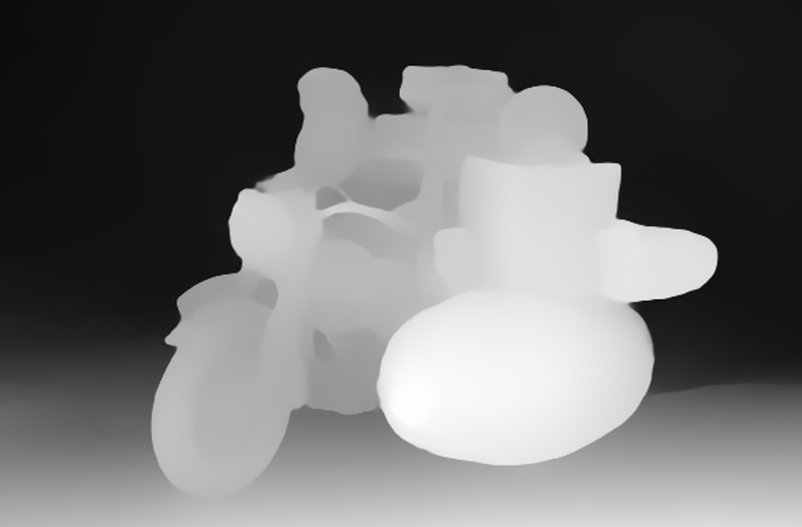

# 3D Depth Effect

## 🔍 Project Overview
본 프로젝트는 단일 2D 이미지를 입력으로 받아, MiDaS 딥러닝 모델을 통해 픽셀 단위 깊이 정보를 추정하고, OpenCV 기반의 시차 효과(Parallax Effect)를 적용하여 마치 이미지 속 장면이 3D처럼 살아 움직이는 듯한 입체적인 시각 효과를 구현합니다

## 🎯 Motivation
소품샵 [프레젠트모먼트(PRESENT MOMENT)](https://presentmoment.kr/85/?idx=150#prod_detail_detail)에서 본 월레스와 그로밋 3D 렌티큘러 카드에서 영감을 받았습니다 ~ 

## 🎥 Demo Video

## 🖼️ Depth map output 

위 이미지는 MiDaS 모델로 생성된 Depth Map이며 가까운 영역일수록 밝게, 먼 영역일수록 어둡게 나타납니다.

## 🔧 Features
- **MiDaS 모델 기반 깊이 추정**  
  DPT-Hybrid 모델 (`dpt_hybrid_384.pt`)을 활용하여 단일 RGB 이미지로부터 픽셀별 상대 깊이 정보를 예측합니다.

- **시차 효과 (Parallax Effect)**  
  예측된 깊이를 바탕으로 가까운 픽셀은 더 많이, 먼 픽셀은 덜 이동시키는 방식으로 입체감 있는 움직임을 구현합니다.

- **Z-Buffer 기반 깊이 충돌 방지 및 픽셀 재배치**  
  픽셀이 이동한 이후, 깊이에 따라 겹침을 방지하여 현실감 있는 시차 표현을 유도합니다.

- **OpenCV 기반 Inpainting 및 경계 Blur 처리**  
  픽셀 이동으로 생기는 공백을 `cv2.inpaint`로 보완하고, Sobel edge + Gaussian blur를 이용해 경계선을 자연스럽게 합니다. 

- **자동 움직임 or 마우스 기반 인터랙션**  
  기본적으로는 `np.sin` 기반 자동 움직임을 구현했으며, main.py 마우스 기반 인터랙션 주석을 해제하면 마우스를 따라 움직이는 모션도 가능합니다.

## 📚 References
깊이 추정에는 Intelligent Systems Lab (ISL)에서 제공하는 MiDaS 저장소의 코드와 모델 구조를 활용하였습니다.
models/midas 디렉토리 전체를 사용해 단일 이미지 기반의 깊이 추정을 수행했습니다.

⚠️ GitHub의 용량 제한으로 인해 학습된 모델 파일(dpt_hybrid_384.pt)은 본 레포지토리에 포함되어 있지 않습니다.
실행을 위해서는 MiDaS 공식 저장소에서 모델 파일을 다운로드한 후 아래 경로에 수동으로 넣어주세요:
> models/midas/dpt_hybrid_384.pt
- 다운로드 : [Official MiDaS Repository](https://github.com/isl-org/MiDaS)
- 라이선스 : MiDaS 코드는 MIT 라이선스로 배포되며, 자세한 사항은 저장소에서 확인하실 수 있습니다.
- 데모에 사용된 이미지는 [WallpaperBetter](https://www.wallpaperbetter.com/ko)에서 다운로드하였습니다.

  
